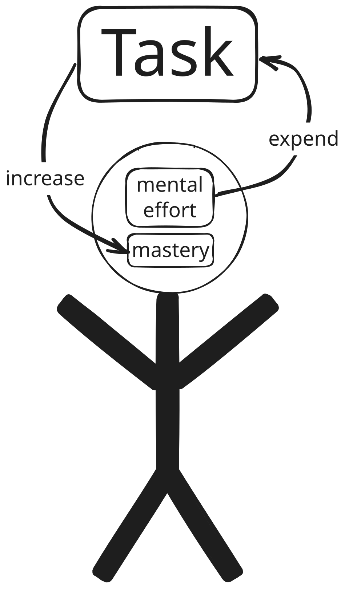

# Video Vault<!-- omit from toc -->

Collection of videos & commentary.

- [The Paradox at the Heart of AI and Science](#the-paradox-at-the-heart-of-ai-and-science)
  - [Comments](#comments)

## The Paradox at the Heart of AI and Science

  

### Comments
Terence Tao is a world-famous mathematician! I love the way he describes challenges in his field with such clarity. I've never felt very comfortable with math or proofs of any kind, yet I was able to understand Tao thanks to his ability to break down the concepts of how AI is actually 'solving proofs' into layman terms. It's an anxiety-relieving video in all this AI chaos.

In the mathmatician world, there are now more proofs that need human reviews than there are available, qualified reviewers - something which was unheard of until recently. Tao talks about the long-term drawbacks of solving proofs in this way, especially in relation to the educating of the next generation of mathmaticians, because an expert is needed to help determine whether the output is good.

> How do you have junior mathmaticians and junior software engineers develop deep, intuitive understanding if **they are not going through the processes that help form this understanding**? There's no shortcut to this process!

<em>Even if AI can perform Task, we still need to do Tasks to increase our own mastery.</em>

Mastery of anything takes repeated practice over the course of many years, decades even. The brain has to form and strength various connections over many wake & sleep cycles (and in many fields other changes are necessary such as muscle development, visual literacy, refining hearing). **A lifetime of dedication still never produces perfection**; we can only do better over time and hope our descendents can continue to iterate towards higher levels of mastery.

